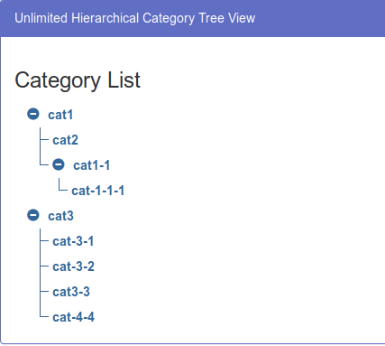

# Category Tree

[DEMO](https://blcts.github.io/tree/)

Your goal is to create a category tree, with infinite depth, without using any library that is implementing trees for you. Something like this:

Your solution should include next features:
- Ability to add new subcategories for each category.
- Rename category.
- Delete category (if it has children - delete them as well).
- Expand/Collapse parent category (children categories should collapse too).

As a bonus you can do any set of optional tasks, you’re free to add anything you can imagine. Some examples:
- Save (and Load) this tree in LocalStorage or some remote database (like Firebase)
- Testing
- Typings
- Styling
- Build & Deploy configurations
- Create Multiple trees

Create a project from scratch. 
The target of your bundle/project should be `build` folder in the root of the repo.
Once you are ready please create a Pull Request against master including all your changes.
